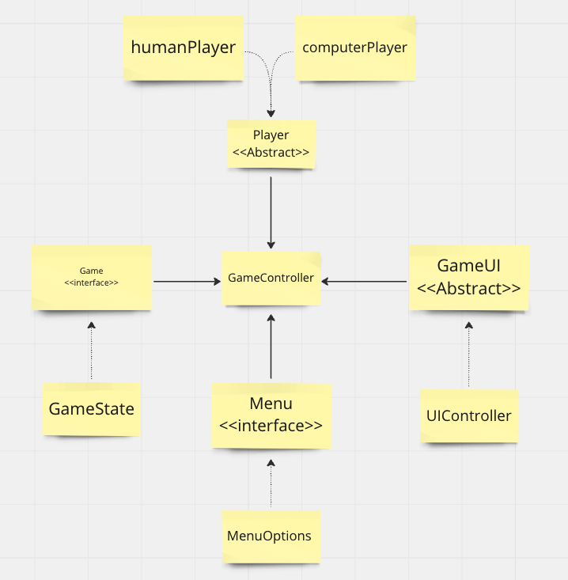

# _Rock Paper Scissors_

Developer: Jeff Ou  
Main Goal: Make a rock-paper-scissors game using Java  
Project Management: [Kanban Board](https://github.com/users/pophero110/projects/3)

# Table of Contents

- [Design Methodology](#design-methodology)
- [Technical Requirement](#technical-requirement)
- [Project Breakdown](#project-breakdown)
  - [Class Diagram](#class-diagram)
  - [User Stories](#user-stories)
- [Hurdle && Win](#hurdle--win)
- [TODO](#todo)
- [Credits](#credits)

# Design Methodology

- Object-oriented design (OOD)
- SOLID Principles

# Technical Requirement

- Use classes to remove repetitive parts of code, and create an abstract Player class to manage the player's state (if they won or lost, how many points they have, what move they made). In addition, interfaces should be used in places where they are necessary.
- Handle invalid user input.
- Handle incorrect capitalization of otherwise valid user input ("rock," "Rock," "RoCk," "ROCK," and more).
- Each class (including a Player class) should have methods associated with it and be instantiated as an object (as opposed to a singleton or an interface).
- Use public, private, and static variables, methods, and members within each class appropriately.
- Incorporate exception handling to make sure your game crashes gracefully if it receives bad input.
- Get standard input with Java using a Scanner, or use Processing to get a mouse, keyboard, or other input.
- Use arrays or array lists to store game history (if applicable).

# Project Breakdown

## Class Diagram

  
[Link to diagram](https://miro.com/app/board/uXjVMT7WbxM=/?share_link_id=990580822840)

## User Stories

- As a player, I'm able to see a main menu with options to play against another player or a computer
- As a player, I'm able to play against a computer
- As a player, there should be a message shown when the game is over
- As a player, I'm able to select among 'rock', 'paper' and 'scissors'
- As a player, I'm able to view my game history
- As a player, I'm able to go back to the main menu
- As a player, I'm able to quit the game
- As a player, I'm able to continue the game when I enter the wrong input
- As a player, I have a player profile that manages my game state, including my points, selected shape, and win/loss/tie counts
- As a player, I want the game to handle incorrect capitalization of valid input like "rock," "Rock," "RoCk," "ROCK," and other variations so that my input will always be recognized and processed correctly
- As a player, I want to be able to play rock-paper-scissors against a human competitor when I choose to play with two players.

# Hurdle && Win

- The biggest hurdle is how to apply SOLID principles.
- The biggest win is that I'm able to write code that follows SOLID principles, which reinforces my knowledge about them.
- Another win is that I am now able to apply SOLID principles not only to the code but also to the design of classes.

# TODO

- Write automated JUnit tests for your application.
- Use an Agile project management framework for your game. ✅
- If the user enters history, the program should display previous game history (winner's name, game date, and more). ✅
- Use Java packages to modularize code. Place any helper tools in these packages — they could be related to input, networking, or graphics.
- Use Maven to install external dependencies your game might require.
- Use generics on collections such as arrays and array lists to store different data composed of different types.
- Use multithreading to handle concurrent requests (like in multiplayer games).
- Incorporate video, text, data, networking, and sound into your game via Processing.

# Credits

- An [article](https://www.freecodecamp.org/news/solid-principles-explained-in-plain-english/) that explains the SOLID principles in plain English.
- An [article](https://dev.to/ivanzm123/stop-using-switch-please-2hif) about how to refactor a long switch statement
